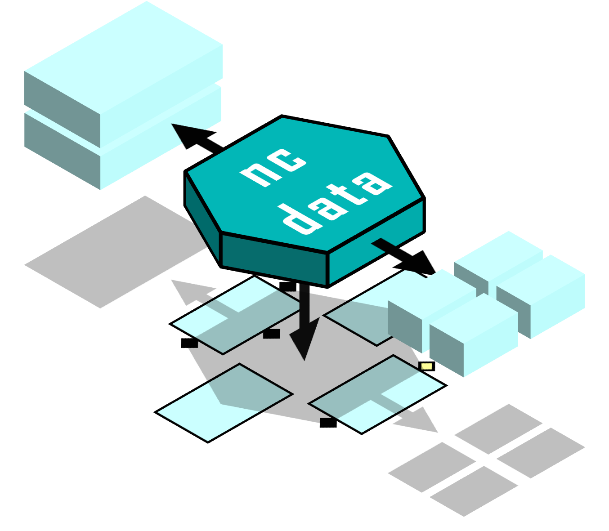

# ncdata



Generic NetCDF data in Python.

Represents raw netCDF data in Python, with no structural assumptions or interpretations,
and provides facilities to inspect and manipulate it with complete freedom.

### Also
Provides fast data exchange between analysis packages, and full control of storage
formatting.

Especially : Ncdata **exchanges data between Xarray and Iris** as efficiently as possible  
> "lossless, copy-free and lazy-preserving".

This enables the user to freely mix+match operations from both projects, getting the
"best of both worlds".
  > import xarray  
  > import ncdata.iris_xarray as nci  
  > import iris.quickplot as qplt  
  >   
  > ds = xarray.open_dataset(filepath)  
  > ds_resample = ds.rolling(time=3).mean()  
  > cubes = nci.cubes_from_xarray(ds_resample)  
  > temp_cube = cubes.extract_cube("air_temperature")  
  > qplt.contourf(temp_cube[0])

# Purposes
  * represent netcdf data as structures of Python objects
  * easy manipulation of netcdf data with pythonic syntax
  * Fast and efficient translation of data between Xarray and Iris objects.
     * This allows the user to mix+match features from either package in code. 

See : https://ncdata.readthedocs.io/en/latest/userdocs/user_guide/design_principles.html

# Documentation
On ReadTheDocs.  Please see: 
  * [stable](https://ncdata.readthedocs.io/en/stable/index.html)
  * [latest](https://ncdata.readthedocs.io/en/latest/index.html)

# Demonstration code examples:
  * [Apply Iris regrid to xarray data](#apply-iris-regrid-to-xarray-data)
  * [Use Zarr data in Iris](#use-zarr-data-in-iris)
  * [Correct a mis-coded attribute in Iris input](#correct-a-miscoded-attribute-in-iris-input)
  * [Rename a dimension in xarray output](#rename-a-dimension-in-xarray-output)
  * [Copy selected data to a new file](#copy-selected-data-to-a-new-file)

## Apply Iris regrid to xarray data
``` python
from ncdata.iris_xarray import cubes_to_xarray, cubes_from_xarray
dataset = xarray.open_dataset("file1.nc", chunks="auto")
(cube,) = cubes_from_xarray(dataset)
cube2 = cube.regrid(grid_cube, iris.analysis.PointInCell)
dataset2 = cubes_to_xarray(cube2)
```

## Use Zarr data in Iris
``` python
from ncdata.threadlock_sharing import enable_lockshare
enable_lockshare(iris=True, xarray=True)
import xarray as xr
dataset = xr.open_dataset(input_zarr_path, engine="zarr", chunks="auto")
input_cubes = cubes_from_xarray(dataset)
output_cubes = my_process(input_cubes)
dataset2 = cubes_to_xarray(output_cubes)
dataset2.to_zarr(output_zarr_path)
``` 

## Correct a miscoded attribute in Iris input
``` python
from ncdata.iris import to_iris
enable_lockshare(iris=True)
ncdata = from_nc4(input_path)
for var in ncdata.variables.values():
    if "coords" in var.attributes:
        var.attributes.rename("coords", "coordinates")
cubes = to_iris(ncdata)
```

## Rename a dimension in xarray output
``` python
enable_lockshare(xarray=True)
dataset = xr.open_dataset("file1.nc")
xr_ncdata = from_xarray(dataset)
from ncdata.utils import rename_dimension
rename_dimension(xr_ncdata, "dim0", "newdim")
to_nc4(ncdata, "file_2a.nc")
```

## Copy selected data to a new file
``` python
from ncdata.netcdf4 import from_nc4, to_nc4
ncdata = from_nc4("file1.nc")

# Make a list of partial names to select the wanted variables
keys = ["air_", "surface"]

# Explicitly add dimension names, to include all the dimension variables
keys += list(ncdata.dimensions)

# Identify the wanted variables
select_vars = [
    var
    for var in ncdata.variables.values()
    if any(var.name.startswith(key) for key in keys)
]

# Add any referenced coordinate variables
for var in select_vars:
    coordnames = var.avals.get("coordinates")
    if coordnames:
        for coordname in coordnames.split(" "):
            select_vars.append(ncdata.variables[coordname])

# Replace variables with only the wanted ones
ncdata.variables.clear()
ncdata.variables.addall(select_vars)

# Save
to_nc4(ncdata, "pruned.nc")
```
