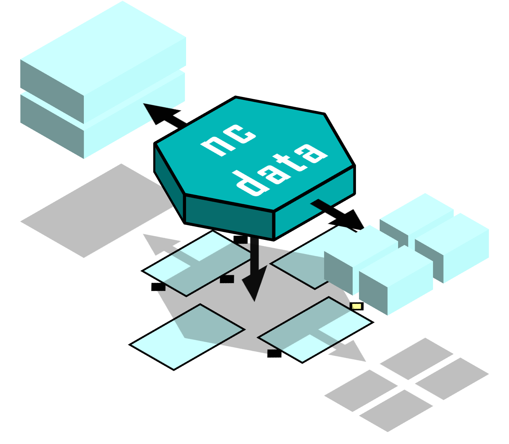

.. ncdata documentation master file, created by
   sphinx-quickstart on Thu Apr  6 17:33:47 2023.
   You can adapt this file completely to your liking, but it should at least
   contain the root `toctree` directive.

ncdata
======

NetCDF data interoperability.

Represents generic netcdf data as Python objects, equivalent to actual data
files, but independent and freely modifiable.

Also supports translation to and from common analysis packages, so that
data can be freely exchanged between packages without data copying.

In particular Ncdata exchanges data **between Xarray and Iris** as efficiently as
possible.

   "lossless, copy-free and lazy-preserving".

This enables the user to freely mix+match operations from both projects, getting the
"best of both worlds".

User Documentation
------------------

.. toctree::
   :maxdepth: 2

   Getting Started <./userdocs/getting_started/getting_started>
   User Guide <./userdocs/user_guide/user_guide>

Reference Documentation
-----------------------

.. toctree::
   :maxdepth: 2

   Python API <./details/api/ncdata>
   Detail Topics <./details/details_index>

Indices and tables
------------------

* :ref:`genindex`
* :ref:`modindex`
